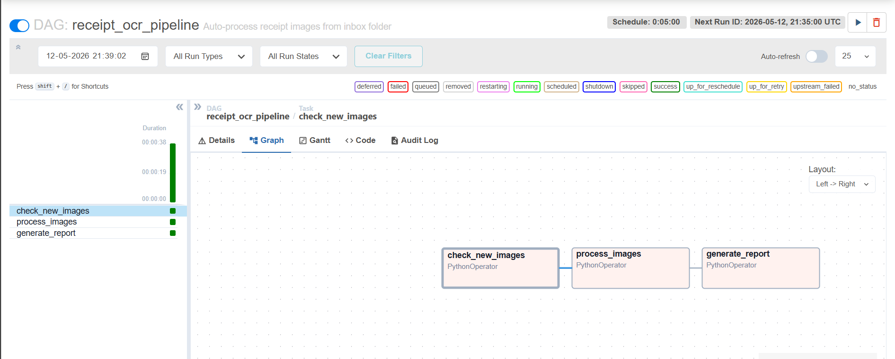

# AI-OCR Receipt Intelligence Pipeline

---

## Overview

An end-to-end pipeline that extracts structured information from receipt images using classical image preprocessing, deep-learning OCR, and rule-based NLP — with per-field confidence scoring, SQLite analytics, and Apache Airflow orchestration.

**Dataset:** 371 real-world receipt images (Walmart, Trader Joe's, Whole Foods, Malaysian stores — Pasaraya, AEON, 99 Speed Mart, Unihakka, and more)

---

## Results Summary

| Metric | Value |
|---|---|
| Receipts processed | 371 |
| Totals extracted | 323 / 371 (87%) |
| High-confidence extractions (≥ 0.5) | 166 |
| Flagged low-confidence fields | 361 receipts had ≥ 1 flag |
| Avg transaction value | ~RM 93.81 |
| Total spend in dataset | RM 30,301.83 |
| Most frequent store | SYARIKAT PERNIAGAAN GIN KEE (24 visits) |
| SQL queries written | 10 (GROUP BY, JOIN, RANK, CASE WHEN, Window Functions) |
| Pipeline orchestration | Apache Airflow DAG (Docker) |

---

## Project Architecture
Receipt Images
↓
Stage 1: OCR Pipeline (pipeline.py)
↓
Stage 2: SQLite Storage + SQL Analytics (db_pipeline.py)
↓
Stage 3: Airflow Orchestration (receipt_dag.py)

---

## Stage 1 — OCR Extraction

### Image Preprocessing (`pipeline.py → preprocess_image`)
Raw receipt photos have noise, uneven lighting, and skew. Each image goes through:
- **Grayscale conversion** — removes colour noise
- **Denoising** — `cv2.fastNlMeansDenoising` smooths sensor noise
- **CLAHE** — adaptive histogram equalisation fixes uneven lighting
- **Otsu binarisation** — converts to clean black/white for OCR
- **Deskew** — detects rotation via `minAreaRect` and corrects angles up to ±30°

### OCR (`pipeline.py → run_ocr`)
**EasyOCR** (CRAFT text detector + CRNN recogniser) was chosen over Tesseract for its superior accuracy on real-world, noisy receipts and its native confidence scores per detected region.

Output per image: a list of `(text, confidence)` tuples.

### Key Information Extraction (`pipeline.py → extract_*`)
Three-pass extraction for each field:

**Store Name**
- Pass 1: keyword match against known store list in the first 10 lines
- Pass 2: first non-address, non-numeric line as fallback
- Address filter: regex patterns detect street addresses (Jalan, postcode, state names) and discard them
- Canonical normaliser maps OCR variants (`"wal mart"`, `"walmart:"`, `"Walmart-"`) to one clean name

**Date**
- Four regex patterns covering `DD/MM/YYYY`, `YYYY-MM-DD`, `Month DD YYYY`, and `DD Month YYYY`

**Total Amount**
- Pass 1: line with a total keyword (ranked: `grand total` > `total` > `subtotal`) that also contains a price on the same line
- Pass 2: price on the line immediately following a total keyword
- Pass 3 (fallback): largest plausible price in the document (capped at 9,999 to exclude barcodes)

**Items**
- Lines containing a price pattern that are not header/footer/summary lines
- Two-line matching: item name on one line, price on the next

### Data Structuring
Each receipt produces a JSON with confidence scores per field:
```json
{
  "file": "0.jpg",
  "store_name":   { "value": "Walmart",    "confidence": 0.701 },
  "date":         { "value": "05/25/10",   "confidence": 0.875 },
  "items":        [{ "name": "BANANAS", "price": "0.49", "confidence": 0.91 }],
  "total_amount": { "value": "5.11",       "confidence": 0.82  },
  "low_confidence_flags": []
}
```

### Confidence Scoring
Field confidence is a weighted combination of:
- **OCR confidence** (0–1) from EasyOCR's detector
- **Pattern match score** — did a regex match? (binary 0 or 1)
- **Keyword score** — was a strong keyword like "TOTAL" present?

Formula used for total:
confidence = 0.4 × ocr_conf + 0.35 × keyword_rank_score + 0.25
Fields below 0.7 are flagged in `low_confidence_flags`.

---

## Stage 2 — SQLite Storage + SQL Analytics

Extracted data is loaded into a **SQLite database** with two tables:

| Table | Rows | Description |
|---|---|---|
| `receipts` | 371 | One row per receipt — store, date, total, confidence scores |
| `line_items` | 545 | One row per line item, linked to receipt via foreign key |

### 10 Analytical SQL Queries

| # | Query | SQL Features Used |
|---|---|---|
| 1 | Overall spend summary | `SUM`, `AVG`, `COUNT` |
| 2 | Top 10 stores by total spend | `GROUP BY`, `ORDER BY` |
| 3 | Store visit frequency ranking | `RANK()` window function |
| 4 | Receipts with missing totals | `WHERE IS NULL` |
| 5 | Top 5 highest value transactions | `ORDER BY DESC` |
| 6 | Spend distribution by store | `CASE WHEN` buckets |
| 7 | Most frequent line items | `GROUP BY` on line_items |
| 8 | Items per store | `JOIN` receipts + line_items |
| 9 | Confidence breakdown | `GROUP BY` flags |
| 10 | Running total per store | `SUM() OVER (PARTITION BY)` |

See `db_pipeline.py` for full query code and `analytics_exports/` for CSV results.

### Key SQL Findings

| Insight | Value |
|---|---|
| Total spend across dataset | RM 30,301.83 |
| Average transaction value | RM 93.81 |
| Most visited store | SYARIKAT PERNIAGAAN GIN KEE — 24 visits |
| Highest single transaction | RM 8,073.78 |
| Receipts missing total | 48 / 371 |

---

## Stage 3 — Apache Airflow Orchestration

The pipeline is orchestrated as an **Airflow DAG** (`receipt_dag.py`) deployed via Docker.

### DAG Structure
check_new_images → process_images → generate_report

| Task | What it does |
|---|---|
| `check_new_images` | Scans inbox folder, fetches already-processed files from DB (idempotency check) |
| `process_images` | Runs OCR extraction and inserts results into SQLite |
| `generate_report` | Queries DB and prints spend summary |

- **Schedule:** every 5 minutes
- **Idempotency:** files already in DB are skipped on re-run
- **XCom:** task 1 passes new file list to task 2 via Airflow XCom
- **Deployed via:** `docker run -p 8080:8080 apache/airflow:2.9.0 standalone`

### Airflow DAG — All Tasks Successful



---

## Tools Used

| Tool | Purpose |
|---|---|
| Python 3.10 | Core language |
| EasyOCR 1.7 | OCR engine (CRAFT + CRNN) |
| OpenCV 4.8 | Image preprocessing |
| Pillow | Image I/O |
| NumPy | Array operations |
| Pandas | Summary aggregation + SQL result export |
| SQLite | Relational database storage |
| Apache Airflow 2.9 | Pipeline orchestration and scheduling |
| Docker | Airflow deployment |
| Google Colab | Runtime environment (free GPU) |
| Google Drive | Dataset storage |

---

## Project Structure
ai-ocr-receipt-pipeline/
├── pipeline.py          # Stage 1: OCR extraction pipeline
├── summary.py           # Financial summary generator
├── db_pipeline.py       # Stage 2: SQLite storage + 10 SQL queries
├── receipt_dag.py       # Stage 3: Airflow DAG definition
├── requirements.txt     # Python dependencies
├── README.md
├── airflow_dag.png      # Screenshot of successful DAG run
└── analytics_exports/   # CSV results from SQL queries (generated at runtime)
├── 01_overall_summary.csv
├── 02_top_stores_by_spend.csv
├── 03_store_visit_frequency.csv
├── 04_missing_totals.csv
└── 05_store_join_summary.csv

---

## How to Run

### Option A — Google Colab (recommended for OCR)
1. Open `AI_OCR_Pipeline.ipynb` in Colab
2. Mount your Google Drive
3. Set `DATASET_PATH` to your Drive folder
4. Run all cells top to bottom

### Option B — Local
```bash
pip install -r requirements.txt
python pipeline.py
python db_pipeline.py
```

### Option C — Airflow (Docker)
```bash
docker run -d -p 8080:8080 --name airflow apache/airflow:2.9.0 standalone
docker cp receipt_dag.py airflow:/opt/airflow/dags/receipt_dag.py
```
Open http://localhost:8080 — login: `admin` / `admin`

> Note: EasyOCR downloads ~1 GB of model weights on first run. GPU strongly recommended.

---

## Challenges Faced

**1. OCR noise on store names**
Many receipts photographed at angles with motion blur. EasyOCR would read `"99 SPEED HART S/8 (519537-X)"` and `"99 SPEEd Hart SV8"` as separate stores. Solved with a canonical normaliser mapping known OCR variants to one clean name.

**2. Multi-language receipts**
Dataset contains English and Malay receipts. Keywords like "JUMLAH" (total) and "AMAUN" (amount) added to extraction rules, address filters extended with Malaysian geographic terms.

**3. Total vs. subtotal ambiguity**
Receipts show SUBTOTAL, TAX, and TOTAL on adjacent lines. Priority ranking ensures GRAND TOTAL > TOTAL > SUBTOTAL.

**4. Address lines picked as store names**
Address-detection regex filter built to skip lines containing Jalan, postcodes, state names.

**5. Items = 0 on many receipts**
Fixed with two-line lookahead: if a line has no price but the next line is a standalone price, they are paired as an item.

---

## Potential Improvements

- **Fuzzy store name deduplication** using `rapidfuzz` to merge remaining OCR variants
- **Fine-tuning EasyOCR** on receipt-specific data (SROIE dataset)
- **LLM post-processing** using Claude Haiku or GPT-3.5 to clean extracted fields
- **Layout-aware parsing** using LayoutLM for column structure understanding
- **Connect Airflow to real OCR** — replace simulated output with `process_receipt()` call
- **PostgreSQL migration** — swap SQLite for PostgreSQL for production scale

---

## Evaluation Mapping

| Criterion | Implementation |
|---|---|
| Extraction Accuracy (30%) | EasyOCR + 3-pass extraction + keyword priority |
| Robustness to Noise (15%) | CLAHE + denoising + deskew preprocessing |
| Data Structuring (10%) | JSON + SQLite with confidence fields |
| Financial Summary (10%) | `summary.py` + 10 SQL analytical queries |
| Confidence Scoring (20%) | Weighted formula, flagging < 0.7 |
| Code Quality (10%) | Modular functions, clear separation of concerns |
| Edge Case Handling (5%) | Missing receipts, address filtering, price sanity caps |
